# Utivity (ICS4U Final Project)
 A desktop productivity app that tracks the time the user has been working and displays it in a user-friendly way.


## Table of Contents
- [Dependencies](#dependencies)
- [Project Structure](#project-structure)
- [Installation](#installation)
- [Features](#features)
- [Contributors](#contributors)
- [Contact](#contact)


## Languages
- Python (Flask)
<code></code>
- HTML, CSS, JS
<code></code>
<code></code>
- SQLAlchemy
<code></code>

## Dependencies
- [Python 3.0 or later](https://www.python.org/downloads/) 
- [Python Flask](https://pypi.org/project/Flask/) 
- [Python SQLAlchemy](https://pypi.org/project/SQLAlchemy/) 
- [Python PyQt5](https://pypi.org/project/PyQt5/)
- [WTForms 2.3.3 or later](https://pypi.org/project/WTForms/)
- [Flask-Login 0.5.0 or later](https://pypi.org/project/Flask-Login/)
- [Flask-WTF 0.14.3 or later](https://pypi.org/project/Flask-WTF/)
- [Python PyFladesk 1.1](https://pypi.org/project/PyFladesk/)


## Project Structure (Ignore cache and setting files)
  ```sh
  ├── README.md
  ├── app.py
  ├── data.db
  ├── config.py
  ├── routes.py
  ├── pyfladesk.py
  ├── .gitignore
  ├── .gitattributes
  ├── static
  │   ├── styles.css
  │   ├── js
  │   │   └── main.js
  │   ├── images
  │   │   ├── splashscreen.gif
  │   │   ├── check-square.png
  │   │   ├── clock.png
  │   │   ├── database.png
  │   │   ├── help-circle.png
  │   │   ├── home.png
  │   │   ├── log-out.png
  │   │   ├── menu.png
  │   │   ├── settings.png
  │   │   ├── utivitybanner1.png
  │   │   ├── fullbanner.png
  │   │   ├── appicon.png
  │   │   ├── utivitybanner2.png
  │   │   └── default.png
  └── templates
      ├── help.html
      ├── history.html
      ├── home.html
      ├── dashboard.html
      ├── login.html
      ├── setting.html
      ├── signup.html      
      ├── template.html
      ├── splash.html
      ├── timer.html
      └── todo.html
  ```

## Installation
* Make sure all the dependencies are installed
* Download the files
  * Option 1: 🍴 Fork this repository!
  * Option 2: 🧪 Clone the repository to your local machine using https://github.com/sagarpatel211/ICS_Productivity_App.git!
* Open *app.py* in Python IDLE or another IDE
* Run *app.py* and start being productive! 🛠


## Features
* Includes an integrated to-do list
* Includes documentation within the help page
* Allows users to register accounts and store their own data
* Includes a timer to keep track of productivity
* Includes a history page to keep a list of all times you've been productive
* Includes a dashboard to display useful information about the user's productivity


## Screenshots
| MainPage    | Register    |
|-------------|-------------|
| 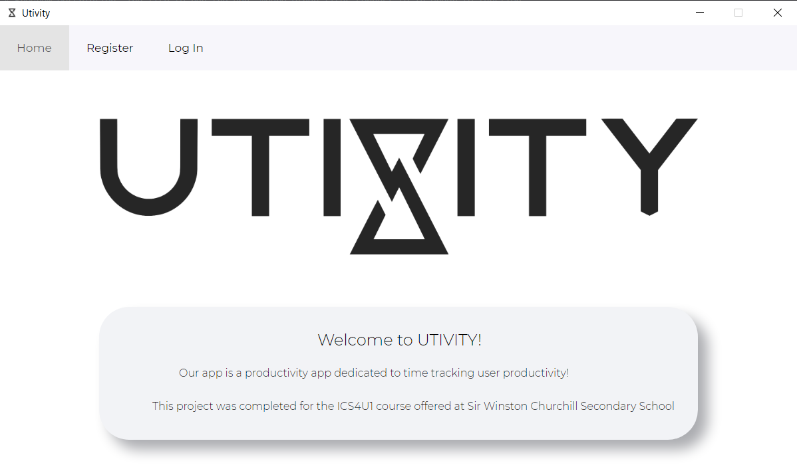 | 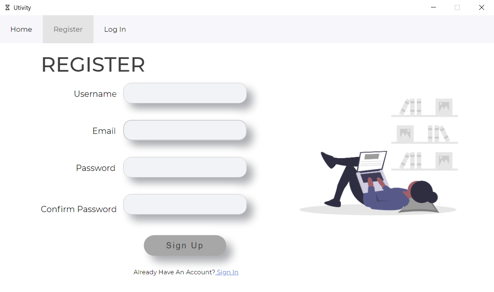 |
| Login       | Stopwatch   |
| 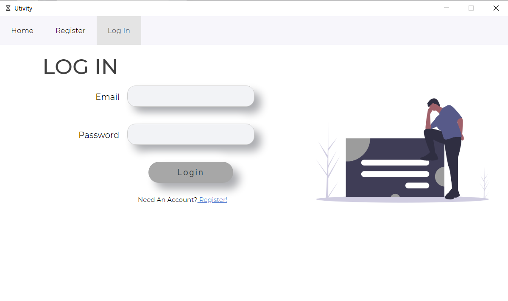 | 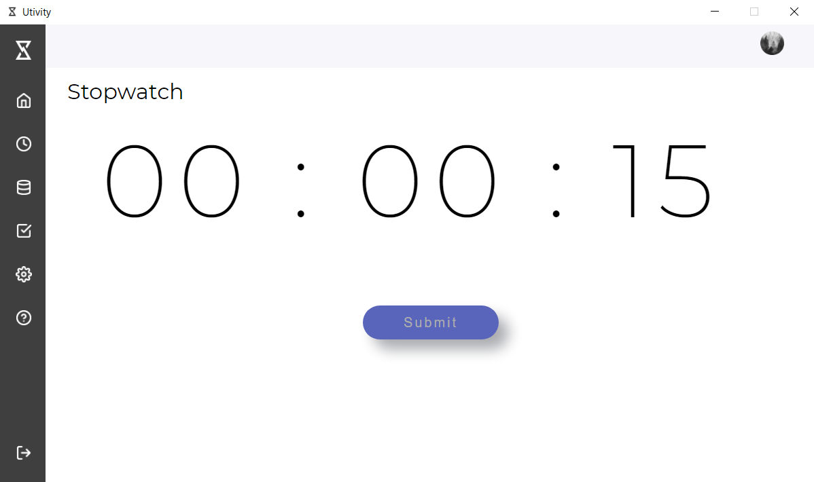 |
| History     | To Do       |
| 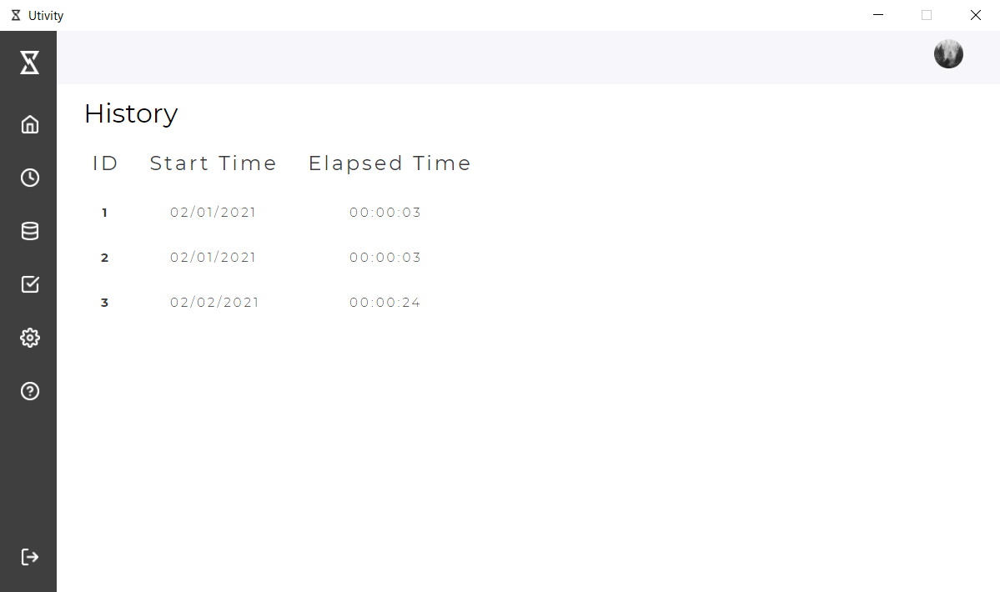 | 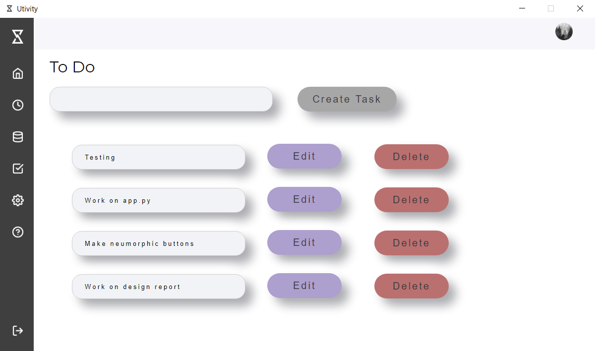 |
| Dashboard   | Settings    |
| 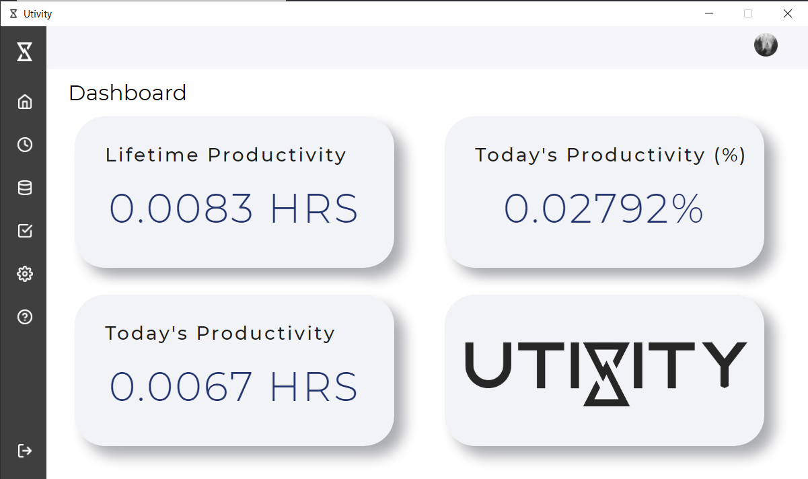 | 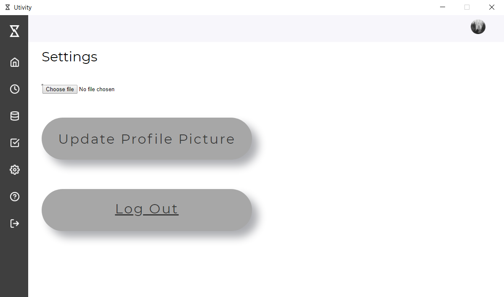 |
| Help Page 1 | Help Page 2 |
| 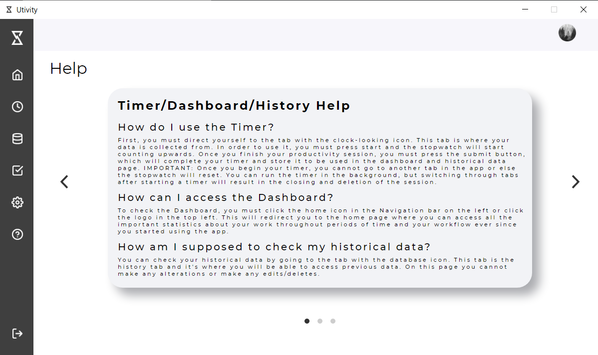 | 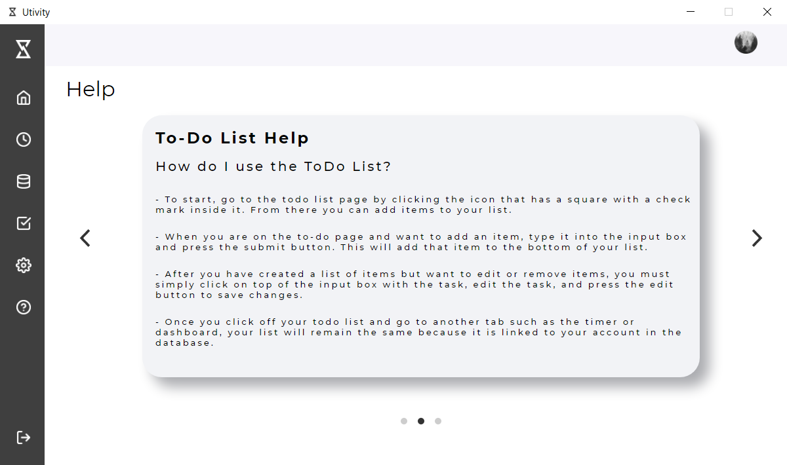 |
| Help Page 3 |
| 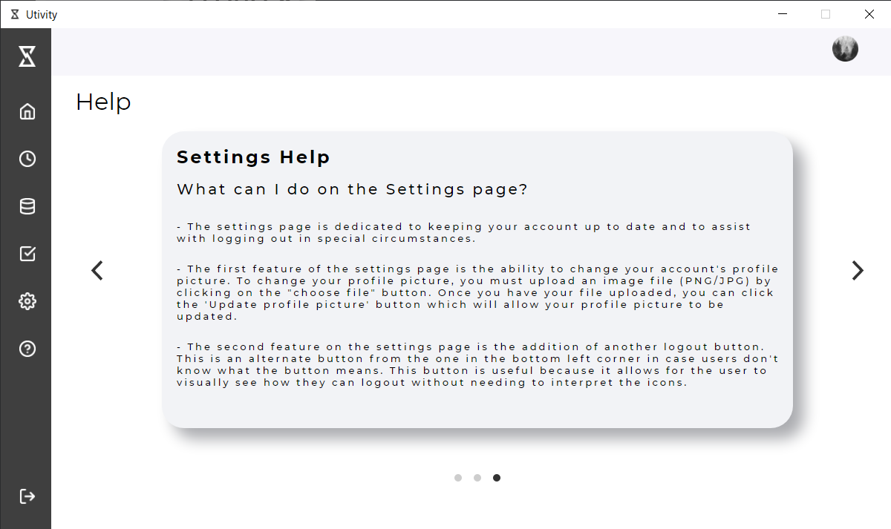 |

## Contributors
| <a href="https://github.com/sagarpatel211" target="_blank">**Sagar Patel**</a> | <a href="http://github.com/saurinpatel20" target="_blank">**Saurin Patel**</a> |
| :---: |:---:|
| [](https://github.com/sagarpatel211)    | [](http://github.com/saurinpatel20) |
| <a href="https://github.com/sagarpatel211" target="_blank">`github.com/sagarpatel211`</a> | <a href="http://github.com/saurinpatel20" target="_blank">`github.com/saurinpatel20`</a> |


## Contact
#### Sagar
[Email](mailto:sa24pate@uwaterloo.ca) | [Website](https://sagarpatel211.github.io/)

#### Saurin
[Email](mailto:sa23pate@uwaterloo.ca) | [Website](https://saurinpatel20.github.io/)


